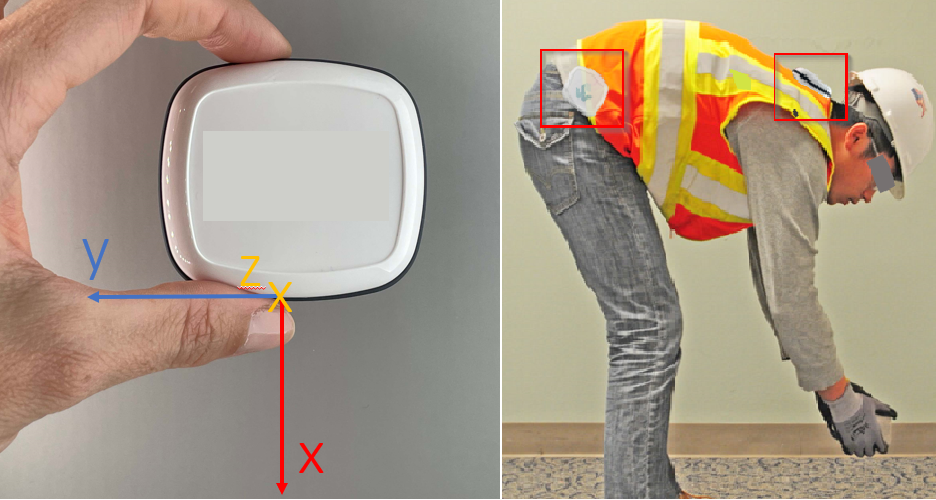

# Spinewise Project   _ (Sensor_measurement)_
### Context dataset: 
##### In attach there is a dataset of sensor measurement data of a person wearing our sensor on his/her shirt collar and on his/her right side of his/her belt. 
##### The person is doing a certain set of movements in a controlled environment. 
##### The dataset contains the following columns (it looks like a lot but a lot is coming back):

- index à [integer increments] index in the dataset: one sample/record/row is created every 0.04 seconds (25 samples/s)

* 
  * acc_x_n à [gravitational gravity g – 9.81 m/s²] acceleration in the neck/collar wearable with the axis pointing towards the ground.
  * acc_y_n à [gravitational gravity g – 9.81 m/s²] acceleration in the neck/collar wearable with the axis pointing towards the left-hand side.
  * acc_z_n à [gravitational gravity g – 9.81 m/s²] acceleration in the neck/collar wearable with the axis pointing towards the front.
  * 
 

*
  * gyr_x_n à [angular velocity ω - radian/s] average angular velocity during the sample taking (0.04s) in the neck/collar wearable around the axis pointing to the ground (clockwise).
  * gyr_y_n à [angular velocity ω - radian/s] average angular velocity during the sample taking (0.04s) in the neck/collar wearable around the axis pointing to the left-hand side (clockwise).
  * gyr_z_n à [angular velocity ω - radian/s] average angular velocity during the sample taking (0.04s) in the neck/collar wearable around the axis pointing to the front (clockwise).
  * 
 

* 
  * mag_x_n à [earths magnetic field – nanoTesla nT] Magnetic field measurement in the neck/collar wearable towards the ground.
  * mag_y_n à [earths magnetic field – nanoTesla nT] Magnetic field measurement in the neck/collar wearable towards the left-hand side.
  * mag_z_n à [earths magnetic field – nanoTesla nT] Magnetic field measurement in the neck/collar wearable towards the front.

 

*
  * acc_x_r à same acceleration sensor as above but for the belt wearable, with the axis pointing towards the ground.
  * acc_y_r à same acceleration sensor as above but for the belt wearable, with the axis pointing towards the back.
  * acc_z_r à same acceleration sensor as above but for the belt wearable, with the axis pointing towards the left-hand side of the person.

 

* 
  * gyr_x_r à same angular velocity sensor as above, but for the belt wearable around the axis pointing to the ground (clockwise).
  * gyr_y_r à same angular velocity sensor as above, but for the belt wearable around the axis pointing to the back (clockwise).
  * gyr_z_r à same angular velocity sensor as above, but for the belt wearable around the axis pointing to the left-hand side of the person (clockwise).

 

* 
  * mag_x_r à same magnetic field sensor as above, but for the belt wearable around the axis pointing to the ground.
  * mag_y_r à same magnetic field sensor as above, but for the belt wearable around the axis pointing to the back.
  * mag_z_r à same magnetic field sensor as above, but for the belt wearable around the axis pointing to the left-hand side of the person.

 

* 
  * q1n à [0,1] quaternion 1 for the neck/collar wearable – the four dimensions of a quaternion provide the orientation of the wearable, devised from fusing multiple sensor values together (acc, gyr, mag) (representing this in a 3 dimensional vector results in a pitfall under certain conditions, i.e. Gimball lock).
  * q2n à [0,1] quaternion 2 for the neck/collar wearable.
  * q3n à [0,1] quaternion 3 for the neck/collar wearable.
  * q4n à [0,1] quaternion 4 for the neck/collar wearable.

 

* 
  * q1r à [0,1] quaternion 1 for the belt wearable.
  * q2r à [0,1] quaternion 2 for the belt wearable.
  * q3r à [0,1] quaternion 3 for the belt wearable.
  * q4r à [0,1] quaternion 4 for the belt wearable.

Below is an image for a clearer representation of the 3 axes of our wearable, and where the wearable was placed.

### Context data lake: 
-------------
- This is a dataset in a controlled environment, there is a video available so we can manually label the movements that the person was doing during the recording. However, this is not our only dataset. This dataset is around 2 MBs in size, while our data lake currently contains 10s of GBs of this kind of data and it continues to grow. Only a very small portion of this data is in a controlled environment (with video), say 0.01%.  

### Challenge: 
-------------
- We want to leverage this growing data lake of unlabelled data into an algorithm that allows us to gain more insights in the movements that were performed. How would you go about this?
